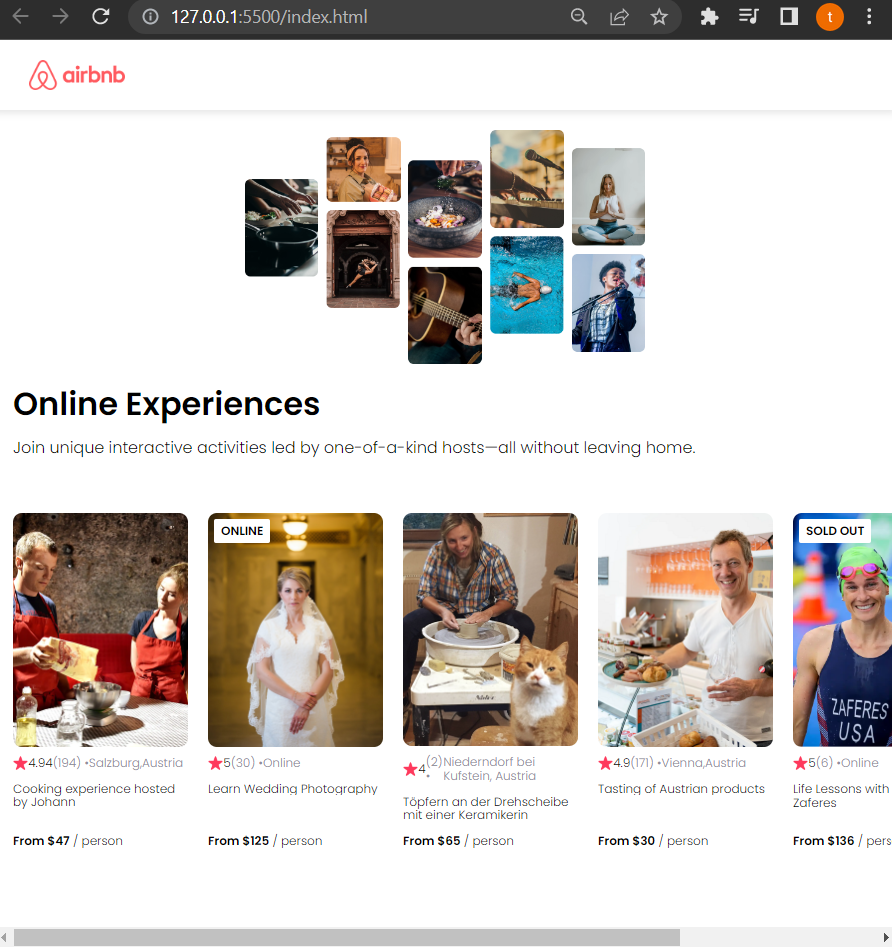

# AirBnb clone

## making use of React custom components and declarative capabilities of react to create Airbnb clone with a few lines of code 

Quick start:

```
$ yarn # npm install
$ yarn build # npm run build
````

## Development

Run Webpack in watch-mode to continually compile the JavaScript as you work:

```
$ yarn watch # npm run watch
```
## Screenshots




## Authors

- [@Tarek Habash](https://github.com/tarek797)
